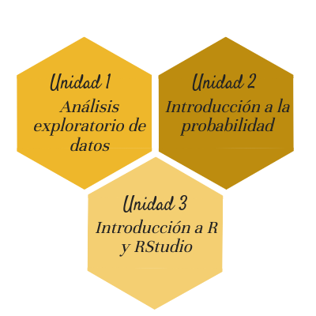

```{r setup, include=FALSE}
knitr::opts_chunk$set(comment = NA)

# colores
c0= "#b0394a"
c1= "#ad6395"
c2= "#a391c4"
c3= "#8acfe6"
c4= "#646420"
c5= "#db524f"
```


```{r, echo=FALSE, out.width="50%", fig.align = "center"}

```